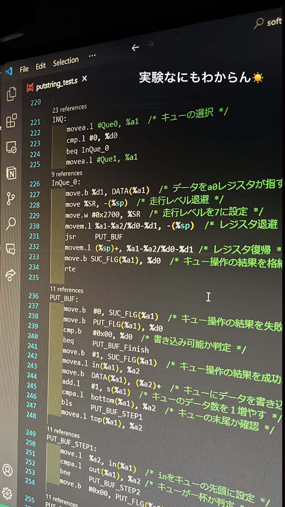
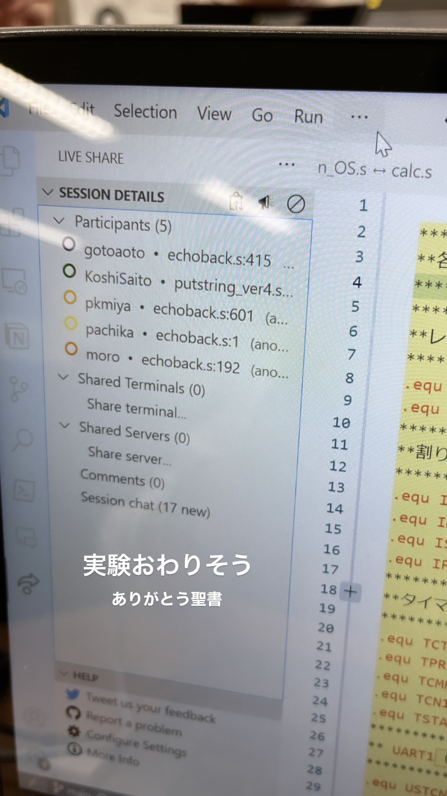
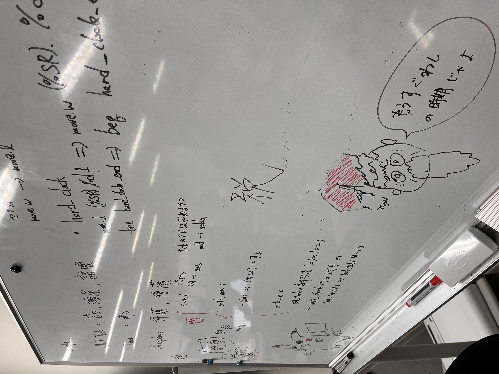

# Outline
## Purpose
This repository has been created to save the records of our efforts on software experiments.

## Target
For the subject "Electrical engineering and computer science experiment II / III" in the 3rd semester of the Course of Computer Science, Department of Electrical Engineering and Computer Science, Faculty of Engineering, Kyushu University.

# Repository structure
| Directory | Period | Description |
|:--|:--| :--|
| fund-software-exp | 2023-10-3 ~ 2023-10-18 (11 times) | CPU Mechanism, Fundamentals of assembly language |
| software-exp-I | 2023-10-24 ~ 2023-11-22 (15 times) | OS development |
| software-exp-II-III | 2023-11-24 ~ 2023-01-19 (23 times) | C library connection, Multi-task, Multiple ports I/O |

# Thanks
- I deeply appreciate the following people (my group members) for their collaborations with me and contributions for this experiment. 
- [@KotaTakeishi](https://github.com/KotaTakeishi),
[@KoshiSaito](https://github.com/KoshiSaito),
[@Seo0904](https://github.com/Seo0904),
[@moro7595](https://github.com/moro7595/),
[@gotoaoto](https://github.com/gotoaoto),

# Experiment images

<video controls src="./img/4.mp4"></video>

